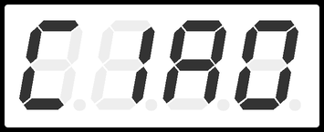

# MAPD_A-Project
Optional project of the MAPD (module A) course following the hands-on lectures, done with [@francescopazzocco](https://github.com/francescopazzocco)

- Write and run a program in assembly for Arduino to print “CIAO” on 4 seven-segments displays

------

Reference : Microchip AVR® Instruction Set Manual
